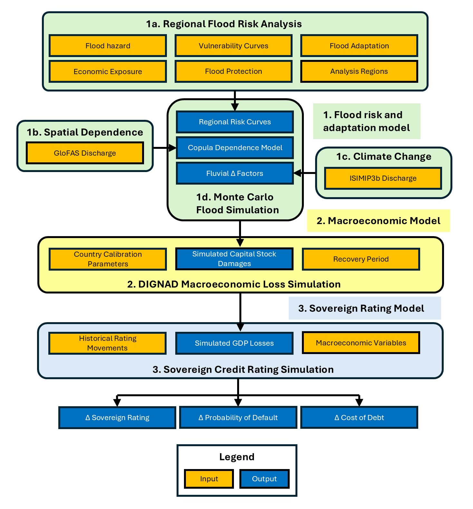

# Code for “Modelling the impact of physical climate risk and adaptation on sovereign credit ratings”

This repository contains the code used for the analysis in the paper **“Modelling the impact of physical climate risk and adaptation on sovereign credit ratings”**, published in the *Oxford Review of Economic Policy*.

The repository implements a probabilistic modelling framework for estimating the impacts of flooding, climate change, and adaptation on Thailand’s sovereign credit rating. 

## Methodology

The code links three types of model: (1) a flood risk and adaptation model, (2) a macroeconomic model (the IMF's DIGNAD), and (3) a sovereign rating model. The overall modelling framework is pictured below. Please refer to the accompanying academic paper for a detailed breakdown of the methodology.



## Prerequisites

To reproduce the analysis, users need:

1. the code in this repository;
2. the archived input and output folders from Zenodo;
3. a local installation of the IMF DIGNAD toolkit;
4. MATLAB, required for the DIGNAD-linked parts of the workflow;
5. the Python environment specified in `environment.yml`.

### 1. Download the input and output folders

The input and output folders required to reproduce the analysis are archived separately on Zenodo:

> **Zenodo record:** [https://doi.org/10.5281/zenodo.20797017](https://doi.org/10.5281/zenodo.20797017)

Download the Zenodo archive and unzip/copy the supplied folders into the root of this repository

### 2. Set up DIGNAD

The DIGNAD-linked parts of the workflow require the IMF DIGNAD toolkit and MATLAB.

For DIGNAD specific set-up instructions, please access the notes here:

> [DIGNAD setup guide](assets/DIGNAD_SETUP.md)

After completing these steps, the repository should look like:

```text
adaptation-smart-ratings/
├── inputs/
├── outputs/
├── DIGNAD/
├── notebooks/
├── sovereign/
└── environment.yml
```

The `inputs/`, `outputs/`, and `DIGNAD/` directories are intentionally ignored by Git because they contain large files, generated outputs, or third-party materials.

## Setting up the Python environment

Create the Python environment from the repository root:

```bash
conda env create -f environment.yml
conda activate sovereign-risk
pip install -e .
```

Then open the notebooks from the repository root:

```bash
jupyter notebook
```

## Reproducing the analysis

There are two ways to reproduce the analysis.

### Option 1: Full model reproduction

To reproduce the full modelling workflow, run the notebooks in the following order:

1. `notebooks/preparation/` — runtime: approximately 3.5 hours
2. `notebooks/pre_sim/` — runtime: approximately 28 hours
3. `notebooks/paper_analysis/full_simulation.ipynb` — runtime: approximately 3 hours
4. `notebooks/paper_analysis/validation_2011_floods.ipynb` — runtime: approximately 20 minutes
5. `notebooks/paper_analysis/results_and_figures.ipynb` — runtime: approximately 5 minutes

The full workflow takes approximately 35 hours in total, although runtimes will vary depending on hardware. This route requires the archived Zenodo "inputs" folder, MATLAB, and the IMF DIGNAD toolkit.

### Option 2: Reproduce paper figures and summary statistics only

To reproduce the final figures and summary statistics from the archived model outputs, run:

```text
notebooks/paper_analysis/results_and_figures.ipynb
```

This route uses the pre-computed model outputs supplied in the Zenodo "outputs" folder and does not require rerunning the full flood risk, DIGNAD, or sovereign rating simulation workflow.

## Citation

If you use this repository, please cite the accompanying academic paper:

> Bernhofen, M. et al. “Modelling the impact of physical climate risk and adaptation on sovereign credit ratings”. *Oxford Review of Economic Policy*. Citation details to be added when available.
