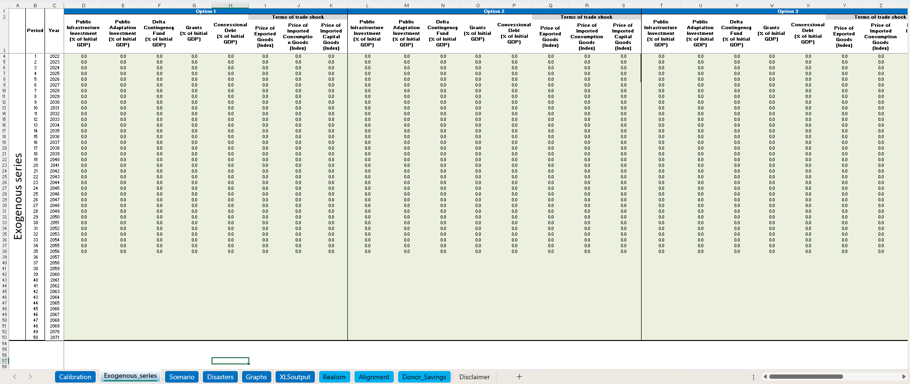
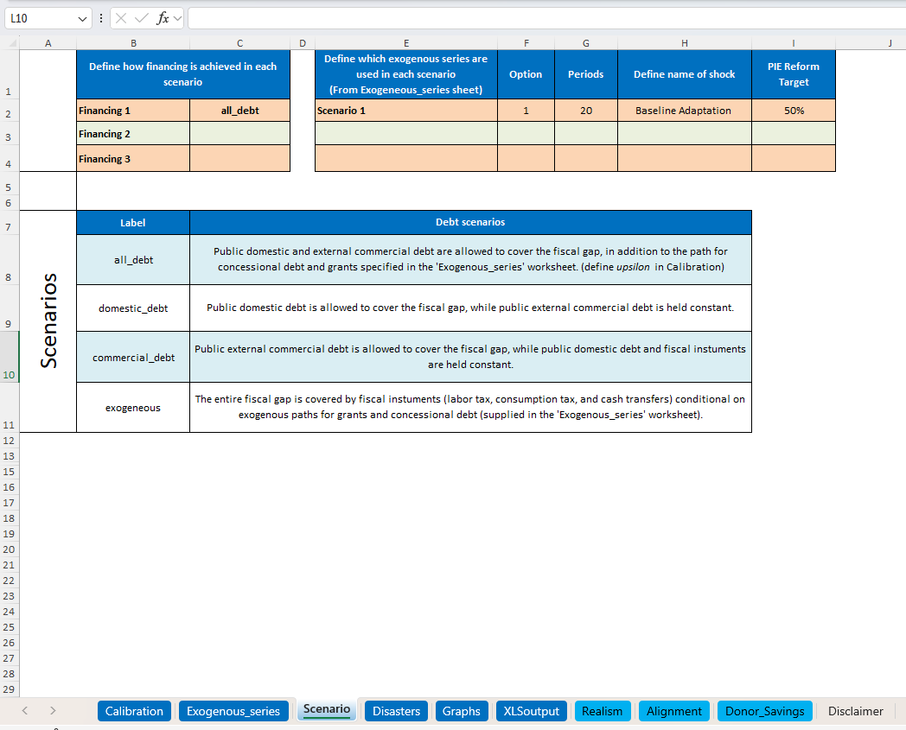
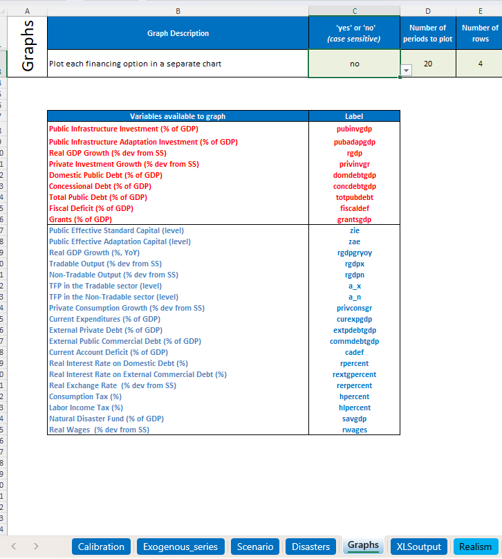
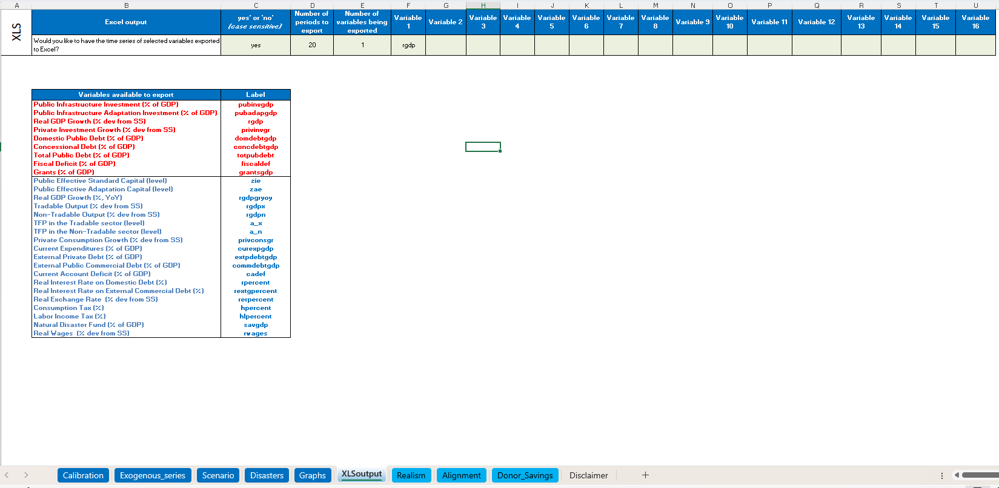

# DIGNAD setup guide

This guide explains how to set up the IMF DIGNAD toolkit for use with the code in this repository.

The DIGNAD-linked parts of the workflow require:

- the IMF DIGNAD toolkit;
- MATLAB;
- the local folder structure expected by this repository.

The DIGNAD toolkit itself is not included in this repository because it is third-party software.

## 1. Download the DIGNAD toolkit

Download the DIGNAD toolkit and user manual from the IMF DIGNAD page:

<https://climatedata.imf.org/pages/dignad>

The IMF user manual provides the official instructions for installing and running the toolkit. The notes below describe the additional setup used for this paper's reproducibility workflow.

## 2. Place DIGNAD in the expected folder

After downloading the toolkit, unzip it and copy it into the root of this repository:

```text
DIGNAD/
```

The final folder structure should look like this:

```text
adaptation-smart-ratings/
├── DIGNAD/
│   └── DIGNAD_Toolkit
├── inputs/
├── outputs/
├── notebooks/
├── sovereign/
└── environment.yml
```

The expected path to the toolkit is:

```text
DIGNAD/DIGNAD_Toolkit/
```

The Thailand-calibrated input workbook should be available at:

```text
DIGNAD/DIGNAD_Toolkit/input_DIG-ND.xlsx
```

If your local folder names differ, update the relevant paths in the notebooks before running the DIGNAD-linked parts of the workflow.

## 3. Check MATLAB access

The DIGNAD-linked notebooks call MATLAB to run the macroeconomic model.

From a terminal, check that MATLAB can be found:

```bash
matlab -h
```

If this command is not recognised, add MATLAB to your system `PATH`, or run the workflow from a terminal where MATLAB is available.

On Windows, this may require adding the MATLAB `bin` directory to your system path. For example, the path may look similar to:

```text
C:\Program Files\MATLAB\R2023b\bin
```

The exact path will depend on your MATLAB version and installation location.

## 4. Prepare the DIGNAD input workbook

Before running the model, open the Thailand-calibrated DIGNAD input workbook:

```text
DIGNAD/input_DIG-ND.xlsx
```

The workbook must be configured so that the model runs as intended and so that the Python scripts can extract the relevant outputs from each DIGNAD run. Most changes to the DIGNAD input file are made automatically by the notebooks, but the following sheets should be checked manually before running the full workflow.

### 4.1 `Exogenous_series` sheet

In the `Exogenous_series` sheet, set all exogenous series values to `0`.

The Python scripts will automatically overwrite these values where required for each model run. Setting the sheet to zero at the start ensures that no previous shocks or manually entered values are carried into the simulation.



### 4.2 `Scenario` sheet

In the `Scenario` sheet, configure the scenarios as shown in the screenshot below.

This setup ensures that the model is run using the scenario structure expected by the Python workflow.



### 4.3 `Graphs` sheet

In the `Graphs` sheet, set the `yes or no` option in cell `C3` to:

```text
no
```

This prevents MATLAB from plotting a graph after every model run. This is important for the Monte Carlo simulation because suppressing graph generation substantially speeds up repeated DIGNAD runs.



### 4.4 `XLSoutput` sheet

In the `XLSoutput` sheet, set the `yes or no` option in cell `C3` to:

```text
yes
```

Only one output variable should be selected. Set `Variable 1` to:

```text
rgdp
```

This step is important because the simulation script reads directly from the relevant XLS output column. If the `XLSoutput` sheet is not configured correctly, the Python workflow may extract the wrong variable or fail to locate the required model output.



### 4.5 Save the workbook

After making these changes, save the workbook and keep it at:

```text
DIGNAD/input_DIG-ND.xlsx
```


## 5. Notes

The DIGNAD toolkit is developed and distributed by the International Monetary Fund. This repository does not modify or redistribute the toolkit. Users should refer to the official IMF DIGNAD user manual for detailed guidance on the toolkit itself.